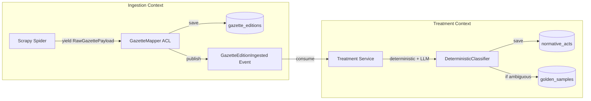

# ADR-001: Scrapy-Based Gazette Ingestion and Multi-Tier Digestion Architecture

**Status:** APPROVED  
**Date:** 2026-08-28  
**Decision Makers:** Lead Architect (@stangler), High-Performance Implementer (Antigravity)

---

## Context

Brazil produces official gazettes and normative legislation across **three federative tiers**: Federal (Diário Oficial da União - DOU), 26 States + Distrito Federal (Diários Oficiais Estaduais - DOEs), and ~5,570 Municipalities. 

Previous experimental spikes in `playground/` demonstrated that a multithreaded `requests` + `ThreadPoolExecutor` architecture suffers from blocking I/O, uncontrolled memory growth, inability to reliably pause/resume runs, and tight coupling between network scraping and CPU-heavy text extraction. Furthermore, gazette volumes easily reach tens of gigabytes if raw binary PDFs are stored, creating severe disk bottlenecks.

At the domain level, an **OfficialGazette** issue (`GazetteEdition`) is a publication container containing dozens or hundreds of distinct legislative acts (`NormativeAct`), each with its own issuing authority, thematic domain, legal level (Lei, Decreto, Portaria), and temporal validity (active vs. historical).

We require a **Microservices-Ready Modular Monolith** using Domain-Driven Design (DDD) and Clean Hexagonal Architecture to ingest, digest, and index Brazilian legislation with high performance, strict determinism, and zero binary file bloat.

---

## Decision

We will implement an **event-driven, Scrapy-based Ingestion Engine** decoupled from a **Multi-Tier Treatment/Digestion Context** backed by a **Two-Tier Normalized PostgreSQL 16 Store** because:

1. **In-Memory Streaming Text Extraction (Zero Binary Retention)**: Spiders stream PDF bytes into `io.BytesIO` (with `tempfile.SpooledTemporaryFile(max_size=10MB)` fallback for large editions), immediately extract text via `pypdf`, record the `SingleSourceOfTruthUrl` (SSOT URL), and discard raw binary buffers, keeping disk usage to structured text only.
2. **Network Resilience & Politeness**: The Scrapy Downloader is configured with `AutoThrottle`, exponential backoff with decorrelated jitter, and a custom `DomainCircuitBreaker` that suspends failing portals after consecutive 5xx/timeout errors without aborting other state spiders.
3. **Hexagonal Anti-Corruption Layer (ACL)**: Spiders yield untyped `RawGazettePayload` DTOs. A dedicated `GazetteMapper` ACL validates domain invariants, constructs pure `GazetteEdition` domain entities, and forwards them to `GazetteRepositoryPort`.
4. **Normalized Two-Tier PostgreSQL Model (Day 0)**:
   * **`gazette_editions`** (Ingestion): Stores container metadata, publication date, territory IBGE code, SSOT URL, SHA-256 hash, and TOAST-compressed full text.
   * **`normative_acts`** (Treatment): Stores segmented acts linked by FK, with indexed columns for `thematic_domain`, `normative_level`, `issuing_authority`, and `temporal_status`.
   * Columns `full_text` use PostgreSQL 16 LZ4 TOAST compression (`SET COMPRESSION lz4`).
   * Primary keys use UUIDv7; deduplication uses composite unique constraints with `INSERT ... ON CONFLICT DO UPDATE`.
5. **Platform Archetype State Spiders**: State DOEs inherit from platform mixins (`RestApiGazetteSpider`, `MonthlyDirectoryGazetteSpider`, `AspxViewerGazetteSpider`), isolating vendor mechanics from state configuration. Municipal acts published within State DOEs are flagged and partitioned by territory.
6. **Treatment & Active Learning Flywheel**: Segmented acts are categorized by a deterministic regex engine (`DeterministicClassifier`). Ambiguous items (`AmbiguityScore < 0.85`) trigger an LLM fallback, whose verified structured outputs feed a `HeuristicFeedbackFlywheel` (Golden Dataset) to harden deterministic rules in future code revisions.
7. **Single Multi-Role Docker Image**: A single multi-stage Dockerfile built with `uv` executes as non-root (`UID 10001`) and powers all roles (Crawler worker, API server, CLI) with a unified `docker-compose.yml`.
8. **Observability & Security**: Centralized logging masks CPFs and sensitive tokens. Telemetry exposes Prometheus Golden Signals and Domain Metrics in Ubiquitous Language.

---

## Consequences

### Positive
- **Zero Binary Bloat**: Complete elimination of multi-gigabyte PDF storage; only lightweight text and structured metadata are retained.
- **High Concurrency & Low Latency**: Scrapy's async event loop handles hundreds of non-blocking I/O connections simultaneously on a single thread.
- **Pure Domain Core**: Zero Scrapy or ORM dependencies in `domain/`; 100% testable with pure in-memory test doubles.
- **Ultra-Fast Digestion Queries**: PostgreSQL B-Tree and GIN indexes allow sub-millisecond filtering across legal domains, authorities, and temporal statuses.
- **Continuous Cost Reduction**: The active learning flywheel ensures LLM usage declines as deterministic rules expand.

### Negative
- **Initial Boilerplate**: Writing Scrapy base archetypes, DTOs, ACL mappers, and Pydantic Value Objects requires higher upfront ceremony than a one-off script.
- **Reconnaissance Requirement**: State portal URLs must be analyzed via short sandbox spikes before writing the corresponding state spider.

### Neutral
- Scraping throughput is bound by government portal responsiveness and polite AutoThrottle limits rather than internal CPU capacity.

---

## Alternatives Considered

### Alternative A: Multithreaded `requests` + `ThreadPoolExecutor` (Spike Architecture)
- **Pros:** Trivial to write; simple sequential flow.
- **Cons:** High memory overhead per thread; GIL contention; no native pause/resume; manual and brittle retry/circuit-breaker logic.
- **Why rejected:** Unmaintainable and unreliable for crawling 27 states + federal DOU across decades of history.

### Alternative B: Single JSONB Document Model in PostgreSQL
- **Pros:** Stores all extracted laws directly inside a JSON array on the `gazette_editions` row.
- **Cons:** Destroys index efficiency for multi-dimensional filtering; forces full row rewrites during revocation updates; prevents foreign-key referential integrity.
- **Why rejected:** Fails the primary use case of treating and searching individual normative acts independently.

### Alternative C: Storing Raw PDF Binaries on S3/Local Filesystem
- **Pros:** Keeps exact original binary file.
- **Cons:** Consumes hundreds of gigabytes of storage; requires managing file synchronization and dual-write consistency.
- **Why rejected:** The original binary remains permanently accessible via the `SingleSourceOfTruthUrl` (SSOT URL); text extraction is performed on the fly.

---

## Cross-Context State Strategy

- **Boundary Violations Check:** Ingestion and Treatment access their own respective tables. No cross-context direct database writes.
- **Consistency Model:** Eventual Consistency via asynchronous domain events (`GazetteEditionIngested`).
- **Failure Modes & Compensation:** If Treatment fails to parse an act, the parent `GazetteEdition` remains safely stored in Ingestion; failed acts are flagged with `processing_status='FAILED'` for idempotent retry without rolling back raw gazette storage.

---

## Langfuse Ingestion Strategy

For LLM fallback invocations in the Treatment Context:
- **Trace Taxonomy:** 
  - `trace_id`: UUIDv7 matching the `normative_act_id`
  - `session_id`: Matching `crawl_session_id`
  - `tags`: `["context:treatment", "task:act_classification", "env:production"]`
- **Span Hierarchy:** `segment_act` $\longrightarrow$ `classify_metadata` $\longrightarrow$ `validate_schema`
- **Prompt Versioning:** `normative_act_classifier:v1` registered in Langfuse.
- **Score Schema & Quality Gate:**
  - `faithfulness` $\ge 0.95$ (verified against original gazette text excerpt)
  - `confidence_score` $\ge 0.85$ (Pydantic model field)
  - Scores below threshold block promotion to the `HeuristicFeedbackFlywheel` and flag the act for human audit.

---

## Compliance Checklist

- [x] Hexagonal Architecture layers respected (Domain $\to$ Application $\to$ Infrastructure)
- [x] Zero framework dependencies in Domain layer (Pure Python + Pydantic V2)
- [x] Domain models use Value Objects (`TerritoryId`, `GazetteDate`, `DocumentHash`, `FederativeTier`)
- [x] Entities enforce invariants at construction time
- [x] Test strategy defined (Unit, Integration, Contract, Mutation testing targets)
- [x] Observability plan included (Prometheus Golden Signals + Domain Metrics + Sentry + Langfuse)
- [x] LGPD / Security assessed (PII masking for CPFs, non-root Docker execution)
- [x] Ubiquitous Language terms updated in `CONTEXT.md`

---

## References

- Context Glossary: [`CONTEXT.md`](file:///home/stangler/Documents/Python/LEX/CONTEXT.md)
- Reference Corpus: `references/37-DevOps, DDD, TDD, ADRs, Code.md`
- Reference Spiders: `QUERIDO_DIARIO` architectural patterns
