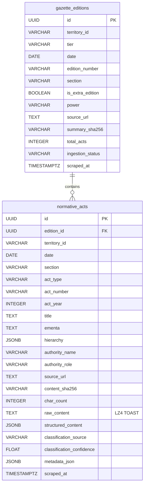

# ADR-002: Normative Acts SSOT and Gazette Editions Metadata Refactoring

**Status:** ACCEPTED  
**Date:** 2026-08-28  
**Decision Makers:** Lead Architect (@stangler), High-Performance Implementer (Antigravity)

---

## Context

In [ADR-001](file:///home/stangler/Documents/Python/LEX/docs/adr/ADR-001-gazette-ingestion-and-digestion-architecture.md), the initial design placed a monolithic `full_text` column inside `gazette_editions` to capture raw ingested content.

Operational live testing with the Federal Official Gazette (DOU - Imprensa Nacional) revealed an essential architectural insight:
1. **Pre-Segmented Native Granularity**: The Federal DOU publishes discrete, canonical HTML articles for each normative act (`https://www.in.gov.br/web/dou/-/<urlTitle>`), with individual titles, hierarchies, ementas, and signatures.
2. **The Concatenation Anti-Pattern**: Artificially concatenating all discrete acts into a monolithic 1M+ character string in `gazette_editions.full_text` — only to immediately parse and segment it again into `normative_acts` — incurs severe redundant I/O, CPU overhead, and storage duplication.
3. **Legal Chain of Custody & Auditability**: In legal analytics and compliance, each normative act requires its own immutable cryptographic hash (`content_sha256`), canonical provenance URL, and granular change history.
4. **Unified SSOT vs. Polymorphic Ingestion**: While ingestion formats vary across federative tiers (pre-segmented HTML for DOU vs. monolithic 500-page PDFs for some State DOEs), downstream consumers (Search, RAG, AI pipelines, and Compliance APIs) require a **single, universal Single Source of Truth (SSOT)**.

---

## Decision

We will refactor the relationship between `gazette_editions` and `normative_acts` into a **Two-Tier Provenance and Domain Model**, establishing **`normative_acts` as the Universal Business SSOT**:

1. **`gazette_editions` as Ingestion Container & Audit Metadata**:
   - Stores publication container metadata: `id` (UUID), `territory_id`, `tier`, `date`, `edition_number`, `section`, `is_extra_edition`, `source_url`, `summary_sha256`, `total_acts`, `ingestion_status`, `scraped_at`, `created_at`, `updated_at`.
   - **Removes monolithic `full_text` from `gazette_editions`** to eliminate redundant storage and artificial concatenation.

2. **`normative_acts` as the Universal Single Source of Truth (SSOT)**:
   - Stores every discrete legislative/administrative act (`Portaria`, `Lei`, `Decreto`, `Resolução`, `Alvará`, `Acórdão`, `Edital`).
   - Foreign key: `edition_id REFERENCES gazette_editions(id) ON DELETE CASCADE`.
   - Stores `raw_content` with PostgreSQL 16 LZ4 TOAST compression (`SET COMPRESSION lz4`).
   - Stores `hierarchy` (JSONB), `authority_name`, `authority_role`, `ementa`, `title`, `act_type`, `act_number`, `act_year`.
   - Stores `structured_content` (JSONB) for AST-segmented articles, paragraphs, and clauses.
   - Stores `classification_source` (`deterministic_regex` | `llm_fallback`) and `classification_confidence`.
   - Uniqueness constraint: `CONSTRAINT uq_normative_act_natural_key UNIQUE (edition_id, source_url, content_sha256)`.

3. **Polymorphic Ingestion Strategy**:
   - **Federal DOU**: The spider emits discrete normative act payloads alongside the edition metadata container. The Ingestion Pipeline atomically creates/updates the `gazette_edition` row and bulk-upserts the child `normative_acts`.
   - **Monolithic State/Municipal Spiders**: When implemented, state crawlers record the edition in `gazette_editions` and pass the raw stream to the `NormativeActSegmenter`, which populates `normative_acts`.

---

## Consequences

### Positive
- **Zero Redundant Storage**: Eliminates multi-megabyte string duplication between `gazette_editions` and `normative_acts`.
- **Granular Legal Custody**: Every normative act carries its own verifiable cryptographic hash (`content_sha256`) and canonical URL.
- **Fast Zero-Scrape Replay**: Re-running AST parsers or LLM classifiers operates directly on `normative_acts.raw_content` in PostgreSQL without touching the web.
- **Unified Downstream APIs**: Search engines, RAG pipelines, and LLM classifiers query a single table (`normative_acts`) regardless of whether the act originated from Federal DOU or a State DOE.

### Negative
- **Migration & Refactoring**: Requires updating domain entities, DTOs, ORM models, and repository interfaces to support the discrete act pipeline.

---

## Domain Model & Schema Specification

---

## Compliance Checklist

- [x] Hexagonal Architecture layers respected
- [x] No framework dependencies in Domain layer
- [x] Domain model uses Value Objects (`TerritoryId`, `GazetteDate`, `DocumentHash`, `ActType`)
- [x] Entities enforce invariants at instantiation
- [x] Domain models strictly separated from ORM models
- [x] PostgreSQL 16 LZ4 TOAST compression configured on `normative_acts.raw_content`
- [x] Zero-Scrape Replay enabled via immutable `raw_content` and cryptographic hashes
