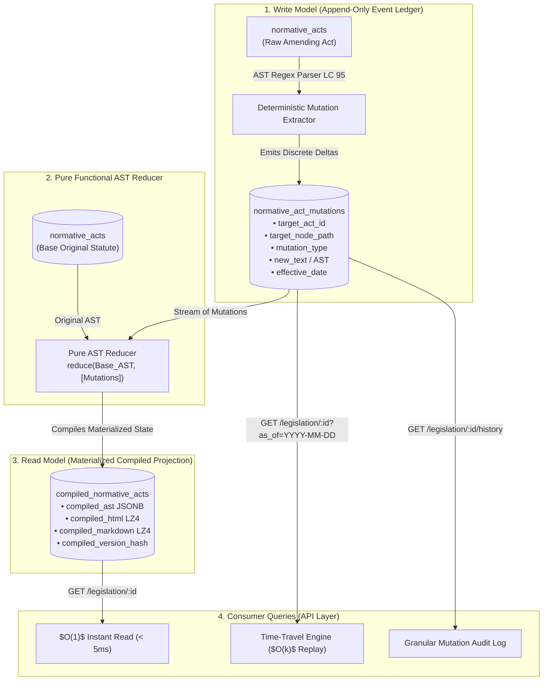

# ADR-006: Legislative Delta Mutation Ledger and Compiled AST Consolidation Engine

**Status:** ACCEPTED  
**Date:** 2026-08-29  
**Decision Makers:** Lead Architect (@stangler), High-Performance Implementer (Antigravity)  
**Bounded Context:** `treatment` & `consolidation`  

---

## 1. Context & Problem Statement

In Brazilian jurisprudence, the drafting and amendment of normative acts are strictly governed by **Lei Complementar nº 95/1998** and regulated by **Decreto nº 9.191/2017**. This regulatory framework institutes a **Patch-Based Legislation Model (Legislação por Delta)**.

Rather than republishing an entire statutory code or statute whenever an amendment occurs, amending statutes publish surgical, targeted mutations. For example:
- *"O art. 3º passa a vigorar com a seguinte redação: [...] (NR)"* — alters an existing provision's text while preserving its structural location.
- *"Fica acrescido o inciso XIV ao art. 3º: [...]"* — injects a new leaf node into the structural hierarchy.
- *"Revogam-se os incisos I e II do caput do art. 5º."* — strips legal efficacy from specific nodes while preserving their historical identity.

### Operational and Technical Challenges
1. **Inefficacy of Plain-Text VCS/Diffs**: Standard line-based diff tools (e.g., GNU diff, Myers diff, Git merges) fail on legal texts because legal modifications are **hierarchical and semantic**, not line-positional. Text formatting, re-wrapping, or whitespace variations produce false merge conflicts or apply mutations to incorrect lines.
2. **Failure of Monolithic Scraping for States & Municipalities**: While the Federal Executive (Presidência da República / Planalto) maintains a staff of civil servants who manually format compiled HTML laws with `<strike>` tags and hyperlinks, this manual curation is nonexistent for the 27 State Official Gazettes (DOEs) and ~5,570 Municipal Official Gazettes (DOMs).
3. **Requirement for Bi-Temporal Time-Travel**: Legal compliance, tax audits, criminal liability, and regulatory reporting require querying the exact statute text in force on any historical date $T$ (*tempo de vigência*) or published as of $T$ (*tempo de publicação*).
4. **Storage Bloat vs. Query Latency Trade-off**: Storing complete full-text copies of a statute for every single amendment creates combinatorial database bloat and write amplification. Conversely, recalculating ASTs dynamically on every read request introduces unacceptable API latency ($> 200\text{ms}$).

---

## 2. Decision

We implement a **CQRS (Command Query Responsibility Segregation) Event-Sourced AST Consolidation Architecture** built on a **Pure Functional Tree Reducer**:



### Core Architectural Invariants

1. **Strict Segregation of Write and Read Models**:
   - **Write Model (`normative_act_mutations`)**: An append-only, immutable event ledger storing atomic deltas. Each delta references the exact target canonical node path (e.g., `art_3.inc_14`), operation type, new text, and authoring act.
   - **Read Model (`compiled_normative_acts`)**: A pre-computed, materialized view storing the latest consolidated AST (`JSONB`) and pre-rendered, hyperlinked HTML/Markdown (`LZ4 TOAST`).
2. **Canonical Hierarchical Node Addressing (LexML / LC 95 Compliant)**:
   - Every provision has an invariant canonical path: `art_{N}.par_{P}.inc_{I}.ali_{A}.item_{T}`.
3. **Pure Deterministic Reducer**:
   - $\text{CompiledAST}_T = \operatorname{reduce}(\text{BaseAST}, [\text{Mutation}_1, \dots, \text{Mutation}_k] \text{ where } \text{effective\_date} \le T)$.
4. **Bi-Temporal Time-Travel**:
   - Default queries read directly from `compiled_normative_acts` ($O(1)$, sub-5ms latency).
   - Historical point-in-time queries (`?as_of=YYYY-MM-DD`) fetch the base AST and fold only the $k$ mutations active up to date $T$ in memory ($O(k)$, sub-15ms latency).
5. **Zero-Scrape Replay**:
   - Refining heuristic parsers allows wiping and re-generating `normative_act_mutations` and `compiled_normative_acts` directly from existing raw database rows without touching external networks.

---

## 3. Didactic Canonical Example: The Mechanics of a Mutation

Consider the evolution of an excerpt of a statute (e.g., Article 3 of a regulatory law):

### 3.1 Base Act (Original Publication — 2010-01-01)
```text
Art. 3º São princípios fundamentais da contratação:
I - legalidade e impessoalidade;
II - moralidade e publicidade.
```
**Base AST Representation:**
```json
{
  "node_path": "art_3",
  "node_type": "artigo",
  "label": "Art. 3º",
  "current_text": "São princípios fundamentais da contratação:",
  "status": "original_active",
  "children": [
    {
      "node_path": "art_3.inc_1",
      "node_type": "inciso",
      "label": "I -",
      "current_text": "legalidade e impessoalidade;",
      "status": "original_active",
      "children": []
    },
    {
      "node_path": "art_3.inc_2",
      "node_type": "inciso",
      "label": "II -",
      "current_text": "moralidade e publicidade.",
      "status": "original_active",
      "children": []
    }
  ]
}
```

---

### 3.2 Amending Act (Lei nº 12.000 — Published & Effective on 2015-06-01)
```text
Art. 1º A Lei nº 10.000/2010 passa a vigorar com as seguintes alterações:
"Art. 3º ............................................................................
I - legalidade, impessoalidade e eficiência; (NR)
......................................................................................
III - desenvolvimento sustentável." (NR)
Art. 2º Revoga-se o inciso II do caput do art. 3º da Lei nº 10.000/2010.
```

**Generated Ledger Mutations (`normative_act_mutations`):**
1. `target_node_path`: `"art_3.inc_1"`, `type`: `ALTERACAO_NR`, `new_text`: `"legalidade, impessoalidade e eficiência;"`, `author_act`: `"Lei 12.000/2015"`.
2. `target_node_path`: `"art_3.inc_2"`, `type`: `REVOGACAO_EXPRESSA`, `new_text`: `NULL`, `author_act`: `"Lei 12.000/2015"`.
3. `target_node_path`: `"art_3.inc_3"`, `type`: `ACRESCIMO`, `new_text`: `"desenvolvimento sustentável."`, `author_act`: `"Lei 12.000/2015"`.

---

### 3.3 Compiled Projection Output (`compiled_normative_acts`)

**Pre-Rendered HTML Projection (Standard Federal Format):**
```html
<p id="art_3" class="artigo">
  <strong>Art. 3º</strong> São princípios fundamentais da contratação:
</p>

<!-- Inciso I: Alterado com histórico e nota de alteração -->
<p id="art_3.inc_1" class="inciso">
  <strike>I - legalidade e impessoalidade;</strike>
  <span class="vigente">I - legalidade, impessoalidade e eficiência;</span>
  <small class="nota-alteracao">(Redação dada pela <a href="/legislation/lei-12000-2015">Lei nº 12.000, de 2015</a>)</small>
</p>

<!-- Inciso II: Revogado com histórico e nota de revogação -->
<p id="art_3.inc_2" class="inciso revogado">
  <strike>II - moralidade e publicidade.</strike>
  <small class="nota-revogacao">(Revogado pela <a href="/legislation/lei-12000-2015">Lei nº 12.000, de 2015</a>)</small>
</p>

<!-- Inciso III: Acrescido com nota de inclusão -->
<p id="art_3.inc_3" class="inciso acrescentado">
  <span class="vigente">III - desenvolvimento sustentável.</span>
  <small class="nota-acrescimo">(Incluído pela <a href="/legislation/lei-12000-2015">Lei nº 12.000, de 2015</a>)</small>
</p>
```

---

## 4. PostgreSQL 16 Data Schema

```sql
-- 1. Enum de Tipos de Mutação Legislativa
CREATE TYPE mutation_type_enum AS ENUM (
    'ACRESCIMO',
    'ALTERACAO_NR',
    'REVOGACAO_EXPRESSA',
    'REVOGACAO_TACITA',
    'SUSPENSAO_EFICACIA',
    'RENUMERACAO',
    'RETIFICACAO'
);

-- 2. Tabela Write Model: Ledger Imutável de Mutações
CREATE TABLE normative_act_mutations (
    id UUID PRIMARY KEY DEFAULT gen_random_uuid(),
    
    -- Relação Alvo / Autor
    target_act_id UUID NOT NULL REFERENCES normative_acts(id) ON DELETE CASCADE,
    target_node_path VARCHAR(120) NOT NULL,
    
    author_act_id UUID NOT NULL REFERENCES normative_acts(id) ON DELETE RESTRICT,
    author_dispositivo_ref VARCHAR(100),
    
    mutation_type mutation_type_enum NOT NULL,
    
    -- Conteúdo do Delta
    new_text TEXT,
    new_structured_payload JSONB,
    
    -- Bi-temporalidade
    publication_date DATE NOT NULL,
    effective_date DATE NOT NULL,
    
    -- Proveniência e Auditoria MLOps
    extraction_source VARCHAR(30) NOT NULL,
    confidence_score FLOAT NOT NULL DEFAULT 1.0,
    mutation_sha256 VARCHAR(64) NOT NULL,
    
    created_at TIMESTAMPTZ NOT NULL DEFAULT CURRENT_TIMESTAMP,
    
    CONSTRAINT uq_mutation_natural_key UNIQUE (target_act_id, target_node_path, author_act_id, mutation_type)
);

CREATE INDEX ix_mutations_target_effective ON normative_act_mutations (target_act_id, effective_date ASC);
CREATE INDEX ix_mutations_target_node ON normative_act_mutations (target_act_id, target_node_path);
CREATE INDEX ix_mutations_author ON normative_act_mutations (author_act_id);

-- 3. Tabela Read Model: Projeção Materializada da Legislação Consolidada
CREATE TABLE compiled_normative_acts (
    act_id UUID PRIMARY KEY REFERENCES normative_acts(id) ON DELETE CASCADE,
    
    compiled_version_hash VARCHAR(64) NOT NULL,
    total_mutations_applied INTEGER NOT NULL DEFAULT 0,
    last_mutation_effective_date DATE,
    
    -- Árvore Consolidada em JSONB (Indexada via GIN)
    compiled_ast JSONB NOT NULL,
    
    -- Texto Formatado Pré-Renderizado (LZ4 TOAST)
    compiled_html TEXT NOT NULL,
    compiled_markdown TEXT NOT NULL,
    
    active_articles_count INTEGER NOT NULL,
    revoked_articles_count INTEGER NOT NULL,
    
    last_compiled_at TIMESTAMPTZ NOT NULL DEFAULT CURRENT_TIMESTAMP,
    updated_at TIMESTAMPTZ NOT NULL DEFAULT CURRENT_TIMESTAMP
);

CREATE INDEX ix_compiled_acts_ast_gin ON compiled_normative_acts USING gin (compiled_ast);
ALTER TABLE compiled_normative_acts ALTER COLUMN compiled_html SET COMPRESSION lz4;
ALTER TABLE compiled_normative_acts ALTER COLUMN compiled_markdown SET COMPRESSION lz4;
```

---

## 5. Consequences

### Positive
- **Instantaneous $O(1)$ API Query Performance**: Pre-rendered HTML and JSON AST enable sub-5ms response times on primary retrieval endpoints.
- **True Bi-Temporal Time-Travel**: Deterministically reconstructs exact past historical statutory wording on date $T$ without data redundancy.
- **Structural Integrity**: Node paths maintain exact legal context, preventing merge conflicts caused by line spacing or typographical formatting shifts.
- **Zero-Scrape Replay Resilience**: Changing regex classifiers or AI heuristics allows re-evaluating the entire history of Brazilian legislation locally from PostgreSQL.

### Negative / Trade-offs
- **Compiler State Machine Complexity**: Requires handling edge-case mutations such as multi-level deletions (`art_3` revoking all its child `incisos`), renumberings, and out-of-order retroactivity.
- **Storage Overhead for Materialized View**: Storing pre-compiled HTML alongside the raw act increases database footprint slightly (mitigated by LZ4 compression).

---

## 6. Compliance Checklist

- [x] Conforms to Lei Complementar nº 95/1998 and Decreto nº 9.191/2017.
- [x] CQRS separation maintained: `normative_act_mutations` (Write) vs. `compiled_normative_acts` (Read).
- [x] PostgreSQL 16 JSONB GIN indexes and LZ4 TOAST text compression configured.
- [x] Bi-temporal querying supported via `publication_date` and `effective_date`.
- [x] Immutable cryptographic provenance hashes (`mutation_sha256`, `compiled_version_hash`).
- [x] Zero network calls required for historical consolidation replay.
