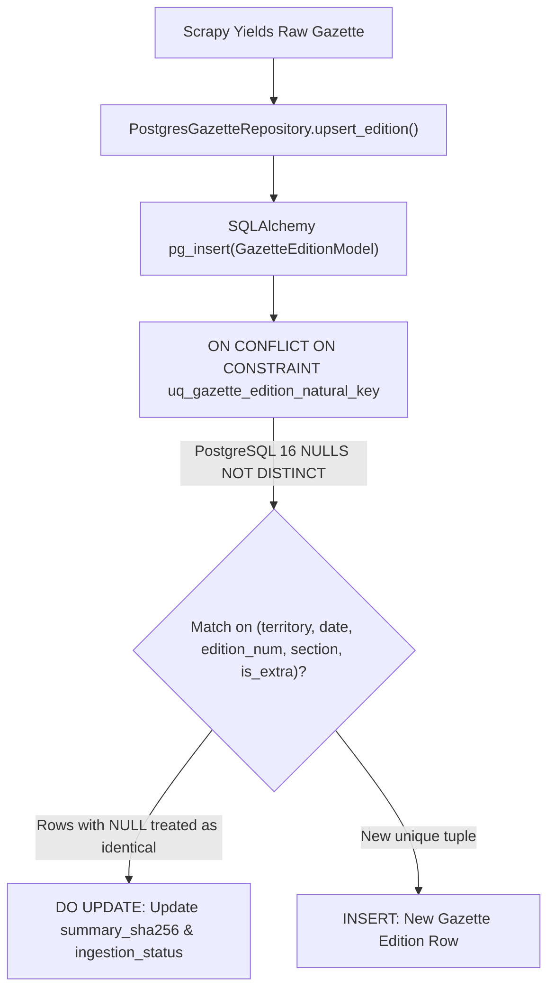

# ADR-012: PostgreSQL NULLS NOT DISTINCT and Upsert Idempotency for Gazette Editions

- **Status**: Accepted
- **Date**: 2026-08-31
- **Deciders**: Principal Socio-Technical Architect, High-Performance Implementer
- **Consulted**: PostgreSQL DBA, Ingestion Pipeline Lead
- **Informed**: Engineering Team
- **Bounded Context**: `ingestion`

---

## 1. Context and Problem Statement

In Brazilian state and municipal official gazettes (e.g. *DOE BA*, *DOE RJ*, *DOM SP*), official gazette editions often lack discrete edition numbers or internal sections, resulting in `NULL` values for `edition_number` and/or `section`.

During vulnerability audit item **CRIT-04**, a critical upsert failure and duplicate row bug was identified:
1. The unique constraint `uq_gazette_edition_natural_key` was defined over `(territory_id, date, edition_number, section, is_extra_edition)`.
2. Under ANSI SQL standard semantics implemented in PostgreSQL by default, `NULL != NULL`. Thus, two rows containing `(BA, 2024-01-15, NULL, NULL, False)` were treated as distinct, non-conflicting rows.
3. When `PostgresGazetteRepository.upsert_edition()` executed `pg_insert().on_conflict_do_update()`, PostgreSQL did not detect any unique constraint violation when columns contained `NULL`.
4. This resulted in duplicate rows being inserted into `gazette_editions` on every spider run, defeating the **Zero-Scrape Idempotent Skip Pattern (ADR-004)** and corrupting edition counts and downstream act linkages.

---

## 2. Decision Drivers

- **Deterministic Upsert Idempotency**: Running a spider multiple times against the same gazette edition must be strictly idempotent ($O(1)$ updates, 0 duplicate rows).
- **PostgreSQL 16 Native Features**: Exploit PostgreSQL 15+ / 16 native `NULLS NOT DISTINCT` on composite unique constraints.
- **Cross-Dialect Fallback Consistency**: Ensure SQLite unit test fixtures and fallback execution paths correctly handle `NULL` comparison semantics using SQL `IS NULL` / `IS NOT DISTINCT FROM`.
- **Pre-flight Map Robustness**: Ensure `get_completed_editions_map()` handles `None` section values as canonical `""` strings so that pre-flight Zero-Scrape lookups match accurately.

---

## 3. Considered Options

- **Option 1: Require dummy string tokens (e.g. `"DEFAULT"`) in domain models**: Replace all `None` values with placeholder strings across the entire domain model. *(Rejected: Pollutes clean domain models with database-specific workarounds).*
- **Option 2: PostgreSQL Partial Indexes**: Create separate partial unique indexes for each combination of NULL and non-NULL columns. *(Rejected: Unnecessary complexity; requires $2^N$ indexes).*
- **Option 3: PostgreSQL 16 `postgresql_nulls_not_distinct=True` with ORM Fallback IS NULL matching (SOTA-KISS)**: Configure `UniqueConstraint(..., postgresql_nulls_not_distinct=True)` on the SQLAlchemy model and apply `IS NULL` matching in the repository fallback path. *(Accepted).*

---

## 4. Decision Outcome

We implement **PostgreSQL 16 Native `NULLS NOT DISTINCT` (Option 3)**:



### 4.1 ORM Table Constraint Definition
In `GazetteEditionModel`:
```python
UniqueConstraint(
    "territory_id",
    "date",
    "edition_number",
    "section",
    "is_extra_edition",
    name="uq_gazette_edition_natural_key",
    postgresql_nulls_not_distinct=True,
)
```

### 4.2 SQLite Fallback Matcher
In `PostgresGazetteRepository.upsert_edition()` fallback:
```python
existing = self._session.execute(
    select(GazetteEditionModel).where(
        GazetteEditionModel.territory_id == edition.territory_id.code,
        GazetteEditionModel.date == edition.date.value,
        (GazetteEditionModel.edition_number == edition.edition_number)
        | (
            (GazetteEditionModel.edition_number.is_(None))
            & (edition.edition_number is None)
        ),
        (GazetteEditionModel.section == edition.section)
        | ((GazetteEditionModel.section.is_(None)) & (edition.section is None)),
        GazetteEditionModel.is_extra_edition == edition.is_extra_edition,
    )
).scalar_one_or_none()
```

---

## 5. Consequences

### Positive
- **100% Upsert Idempotency**: State and municipal gazettes with missing edition numbers or sections are safely upserted without duplication.
- **Zero-Scrape Reliability**: Pre-flight cache and database unique indexes never produce duplicate edition records.
- **Minimal Complexity**: Leverages native PostgreSQL 16 standard features with zero database trigger overhead.

### Negative / Operational Constraints
- Requires PostgreSQL 15 or higher (LEX runtime baseline is PostgreSQL 16.2+).

---

## 6. Compliance & Hexagonal Verification

- [x] Hexagonal Architecture respected (Persistence configuration isolated in Infrastructure models).
- [x] Tested across SQLite unit test harness and PostgreSQL dialect specifications.
