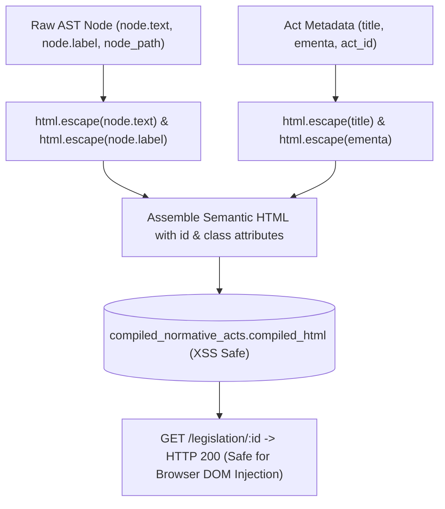

# ADR-013: AST HTML Compilation XSS Sanitization (CWE-79) and API Presentation Hardening

- **Status**: Accepted
- **Date**: 2026-08-31
- **Deciders**: Principal Socio-Technical Architect, High-Performance Implementer
- **Consulted**: Application Security Engineer, Frontend / API Specialist
- **Informed**: Engineering Team
- **Bounded Context**: `consolidation` & `api` (Future API Presentation Reference)

---

## 1. Context and Problem Statement

The Consolidation engine (`PureAstReducer`) reduces hierarchical legislative AST trees and accumulated statutory mutations into pre-rendered HTML read models (`compiled_normative_acts.compiled_html`).

During vulnerability audit item **HIGH-01**, a critical **Stored Cross-Site Scripting (XSS / CWE-79)** vulnerability was identified:
1. `_render_node_html` assembled HTML fragments via direct f-string interpolation (`f"<strong>{node.label}</strong> {node.text}</p>"`).
2. `working_ast.title` and `working_ast.ementa` were directly interpolated into `<h1>` and `<p class="ementa">` tags without HTML entity escaping.
3. If an ingested gazette contained malicious script tags, event handlers (e.g. ``), or unescaped HTML entities inside act titles, ementas, or amendment text, the payload would be stored in the database and executed inside client web browsers when served by the REST API or rendered in frontend web apps.

---

## 2. Decision Drivers

- **Zero Stored XSS (CWE-79 Mitigation)**: All user-controlled, scraper-extracted, or external gazette strings rendered into HTML must be strictly escaped via Python's standard library `html.escape()`.
- **Attribute Injection Prevention**: Attributes such as `id="{node_id}"` and `id="{act_id}"` must enforce `quote=True` escaping.
- **Future API Presentation Baseline**: Formalize clear security boundaries for future REST API and presentation BFF implementations (e.g. FastAPI / SvelteKit) to avoid dual-escaping or raw HTML bypasses.

---

## 3. Considered Options

- **Option 1: Rely on Frontend Auto-Escaping (React/Svelte)**: Assume frontend frameworks will treat `compiled_html` as plain text. *(Rejected: The database explicitly stores `compiled_html` as pre-rendered markup intended for rich DOM insertion; raw unescaped fragments create severe stored XSS hazards).*
- **Option 2: Heavy 3rd-party sanitizer (Bleach / DOMPurify)**: Run an HTML parsing and tag stripping library on every compile. *(Rejected: High CPU overhead on large legislative codes; statutory text should not contain raw HTML tags anyway).*
- **Option 3: Strict `html.escape()` at AST Compilation Layer (SOTA-KISS)**: Apply native, lightning-fast `html.escape()` across all labels, texts, titles, ementas, and node paths prior to HTML element wrapping. *(Accepted).*

---

## 4. Decision Outcome

We implement **Option 3: Strict `html.escape()` at AST Compilation Layer**:



### 4.1 Implementation in `PureAstReducer`
```python
def _render_node_html(node: DispositivoNode) -> str:
    lines: list[str] = []
    node_id = html.escape(node.node_path.value, quote=True)
    escaped_label = html.escape(node.label or "")
    escaped_text = html.escape(node.text or "")

    if node.status == DispositivoStatus.REVOKED:
        lines.append(
            f'<p id="{node_id}" class="dispositivo revogado">'
            f"<strike>{escaped_label} {escaped_text}</strike></p>"
        )
    elif node.status == DispositivoStatus.MODIFIED_ACTIVE:
        lines.append(
            f'<p id="{node_id}" class="dispositivo modificado">'
            f'<span class="vigente">{escaped_label} {escaped_text}</span></p>'
        )
    else:
        lines.append(
            f'<p id="{node_id}" class="dispositivo original">'
            f"<strong>{escaped_label}</strong> {escaped_text}</p>"
        )

    for child in node.children:
        lines.append(_render_node_html(child))

    return "\n".join(lines)
```

### 4.2 Guidelines for Future REST API & Frontend Integration
1. **API Endpoints (`GET /legislation/:id`)**:
   - `compiled_html` returned in responses is guaranteed XSS-safe and sanitized.
   - API endpoints serving raw text or structured JSON must set appropriate `Content-Type` headers (`application/json; charset=utf-8` or `text/html; charset=utf-8`).
   - Content Security Policy (CSP) headers (`default-src 'self'; script-src 'self'`) should be configured on all API gateway responses.
2. **Presentation Layer (SvelteKit / Frontend)**:
   - When rendering `compiled_html` via `{@html compiled_html}`, the payload is safe from stored script injections.

---

## 5. Consequences

### Positive
- **Complete CWE-79 Immunity**: Eliminates stored XSS attacks via statutory text or scraper injection.
- **Zero Overhead**: `html.escape()` executes in microseconds directly in CPython without heavy dependencies.
- **Documented API Standard**: Provides a definitive security baseline for future API feature expansion.

---

## 6. Compliance & Hexagonal Verification

- [x] Pure domain reduction logic retains zero external dependencies.
- [x] Standard library `html` module used exclusively.
- [x] Regression tests assert neutralization of script tags and quote breaking.
