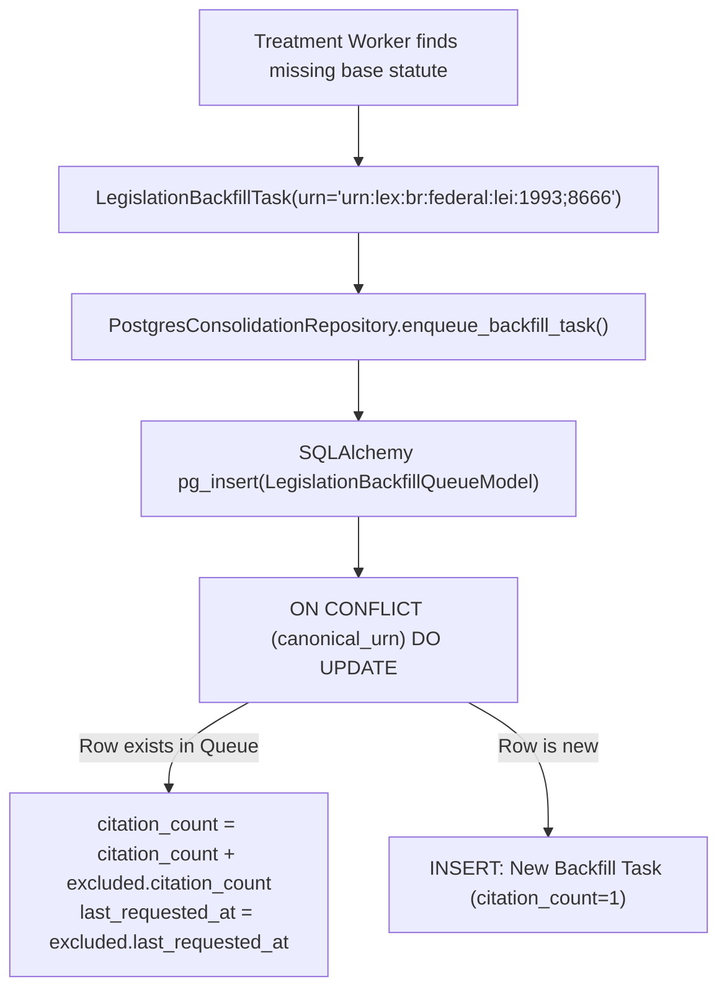

# ADR-014: Atomic Backfill Queue Upsert and Citation Count Concurrency Hardening

- **Status**: Accepted
- **Date**: 2026-08-31
- **Deciders**: Principal Socio-Technical Architect, High-Performance Implementer
- **Consulted**: Database Administrator, Distributed Systems Engineer
- **Informed**: Engineering Team
- **Bounded Context**: `consolidation`

---

## 1. Context and Problem Statement

When processing large gazette batches across concurrent worker processes or asynchronous crawlers, multiple amending acts frequently cite the same historical base statutes (e.g. *Lei nº 8.666/1993*, *Código Civil / Lei nº 10.406/2002*).

During vulnerability audit item **HIGH-02**, a concurrency race condition was identified in `PostgresConsolidationRepository.enqueue_backfill_task`:
1. `enqueue_backfill_task` executed a two-step Read-Then-Write transaction: `SELECT` to check for existing `canonical_urn`, followed by either `UPDATE` or `INSERT`.
2. Under concurrent multi-process treatment (`lex treat --concurrency > 1`), two worker threads checking the queue simultaneously would both execute the `SELECT`, find no existing row, and attempt parallel `INSERT` operations with identical `canonical_urn` values.
3. Because `legislation_backfill_queue.canonical_urn` enforces a `UNIQUE` constraint, the trailing worker failed with `UniqueViolationError` (PostgreSQL error `23505`), aborting treatment. Furthermore, concurrent updates caused lost citation count increments.

---

## 2. Decision Drivers

- **Atomic PostgreSQL Upserts**: Guarantee single-query atomic insert-or-increment operations using `pg_insert().on_conflict_do_update()`.
- **Zero Lock Contention & Concurrency Safety**: Eliminate race conditions and `UniqueViolationError` exceptions across distributed or concurrent workers.
- **Accurate Citation Prioritization**: Ensure the `citation_count` accurately accumulates every statutory citation (`citation_count = citation_count + excluded.citation_count`) to properly rank JIT backfill priorities.

---

## 3. Considered Options

- **Option 1: Table-Level Locking (`LOCK TABLE legislation_backfill_queue`)**: Serialize all queue writes with explicit pessimistic table locks. *(Rejected: Introduces severe database lock contention and degrades pipeline throughput).*
- **Option 2: Application-level Redis Mutex Distributed Locks**: Wrap queue operations in distributed locks. *(Rejected: Introduces external operational infrastructure dependency for an operation PostgreSQL handles natively).*
- **Option 3: Native PostgreSQL `ON CONFLICT (canonical_urn) DO UPDATE` (SOTA-KISS)**: Leverage PostgreSQL's native atomic upsert mechanics with column arithmetic directly in SQL. *(Accepted).*

---

## 4. Decision Outcome

We implement **Native PostgreSQL `ON CONFLICT (canonical_urn) DO UPDATE` (Option 3)**:



### 4.1 Implementation in `PostgresConsolidationRepository`
```python
stmt = pg_insert(LegislationBackfillQueueModel).values(...)
upsert_stmt = stmt.on_conflict_do_update(
    index_elements=["canonical_urn"],
    set_={
        "citation_count": LegislationBackfillQueueModel.citation_count
        + task.citation_count,
        "last_requested_at": stmt.excluded.last_requested_at,
    },
)
self._session.execute(upsert_stmt)
```

---

## 5. Consequences

### Positive
- **100% Concurrency Safe**: Zero race conditions or unique constraint violation exceptions during parallel treatment.
- **Deterministic Prioritization**: JIT historical crawlers always receive mathematically accurate citation counts.
- **High Throughput**: Zero application-level locking overhead; executes within a single atomic database statement.

---

## 6. Compliance & Hexagonal Verification

- [x] Hexagonal Persistence Adapter encapsulates dialect-specific concurrency optimizations.
- [x] Fallback branch maintains full compatibility with in-memory SQLite unit tests.
