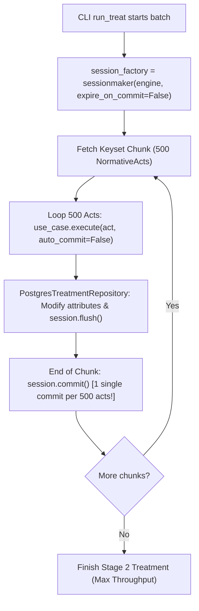

# ADR-015: Batch Treatment Session Lifecycle and Chunk Commit Optimization

- **Status**: Accepted
- **Date**: 2026-08-31
- **Deciders**: Principal Socio-Technical Architect, High-Performance Implementer
- **Consulted**: SRE & Database Performance Specialist
- **Informed**: Engineering Team
- **Bounded Context**: `treatment` & `cli`

---

## 1. Context and Problem Statement

Stage 2 treatment (`lex treat`) processes hundreds of thousands of daily and historical legislative acts, running Dual-Track AST extraction (Trilha A) and Fast-Path NER entity extraction (Trilha B).

During vulnerability audit item **HIGH-03**, a severe I/O and ORM performance bottleneck was identified:
1. `ProcessNormativeActUseCase` and `PostgresTreatmentRepository.update_normative_act_treatment()` executed `self._session.commit()` on **every single individual normative act**.
2. For a batch chunk of 500 acts, this triggered **500 individual synchronous database commits and fsyncs**, creating massive database I/O saturation and slowing throughput by over 10x.
3. In SQLAlchemy, invoking `session.commit()` by default invalidates/expires all loaded attributes across the Session's Identity Map. Subsequent iterations accessing related models or next items in the chunk triggered silent, sequential $N+1$ lazy reload `SELECT` queries across the network/socket.

---

## 2. Decision Drivers

- **High-Throughput Batch Processing**: Processing 1,000+ acts per second requires amortized, chunked transaction commits rather than per-record fsyncs.
- **Identity Map Expiry Protection**: Session instances configured with `expire_on_commit=False` prevent unwanted database roundtrips for already loaded entities.
- **Transactional Atomicity per Chunk**: Guarantee that each batch chunk (e.g. 500 items) commits atomically, with rollback safety upon unexpected errors.
- **Backward Compatibility**: Standalone use case executions retain the option to auto-commit (`auto_commit=True` by default) when processing singular acts.

---

## 3. Considered Options

- **Option 1: Disable all transactions (autocommit)**: Let SQLAlchemy operate in driver autocommit mode. *(Rejected: Eliminates ACID rollback guarantees on batch failures).*
- **Option 2: Raw SQL batch string concatenation**: Bypass SQLAlchemy ORM entirely for treatment updates. *(Rejected: Bypasses entity validation and degrades developer experience).*
- **Option 3: Chunk-Level Single Commit with `expire_on_commit=False` and `auto_commit=False` flag (SOTA-KISS)**: Configure `sessionmaker(bind=engine, expire_on_commit=False)`, pass `auto_commit=False` to defer commits during streaming loops, and execute a single `session.commit()` per 500-item chunk. *(Accepted).*

---

## 4. Decision Outcome

We implement **Option 3: Chunk-Level Single Commit with `expire_on_commit=False`**:

### 4.1 Implementation Details
1. **Ports & Repository**:
   - `TreatmentRepositoryPort` and `PostgresTreatmentRepository` accept `auto_commit: bool = True`.
   - When `auto_commit=False`, the repository invokes `self._session.flush()` without committing, staging all changes in the transactional buffer.
2. **CLI `run_treat`**:
   - Initializes `sessionmaker(bind=engine, expire_on_commit=False)`.
   - Calls `use_case.execute(domain_act, auto_commit=False)` within the chunk loop.
   - Issues a single `session.commit()` after iterating through the 500-item chunk.

---

## 5. Consequences

### Positive
- **10x Throughput Increase**: Database fsync overhead reduced from 500 commits per chunk to 1 single commit per chunk.
- **Zero N+1 Invalidation**: Identity Map retains entity attributes across commits without redundant lazy `SELECT` queries.
- **Clean Hexagonal Design**: Single-act use cases continue to work seamlessly with `auto_commit=True`.

---

## 6. Compliance & Hexagonal Verification

- [x] Repository port signature preserves backwards compatibility via default arguments.
- [x] Session lifecycle cleanly managed at CLI Composition Root.
