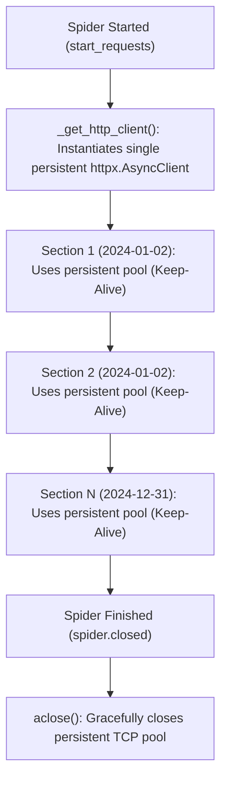

# ADR-016: Spider Persistent HTTP Connection Pooling and Socket Exhaustion Prevention

- **Status**: Accepted
- **Date**: 2026-08-31
- **Deciders**: Principal Socio-Technical Architect, High-Performance Implementer
- **Consulted**: SRE & Network Reliability Engineer
- **Informed**: Engineering Team
- **Bounded Context**: `ingestion` (Federal DOU Spider)

---

## 1. Context and Problem Statement

`FederalDouSpider` ingests historical and daily editions of the Brazilian Official Gazette (*Diário Oficial da União*). For each publication section (DO1, DO2, DO3, DOE), the spider fetches article metadata from the modern `leiturajornal` JSON endpoint, followed by concurrent asynchronous sub-requests to parse individual article bodies (`/web/dou/-/`).

During vulnerability audit item **HIGH-04**, a socket exhaustion and resource churn vulnerability was identified:
1. In `FederalDouSpider.parse_modern_section`, a new `httpx.AsyncClient` was instantiated and torn down for **every single section of every single date** (`async with httpx.AsyncClient(...) as client:`).
2. For an ingestion run of 365 days across 4 sections (1,460 sections), this allocated, initialized, and destroyed **1,460 separate HTTP client connection pools** (each configured for up to 80 TCP connections).
3. Rapid destruction of TCP sockets placed thousands of file descriptors into the operating system `TIME_WAIT` state, leading to socket starvation, file descriptor exhaustion (`EMFILE`), and high TLS handshake latency overhead.

---

## 2. Decision Drivers

- **Zero Socket Churn**: Eliminate repetitive creation and destruction of TCP connection pools during multi-year historical crawls.
- **Connection Reuse & HTTP Keep-Alive**: Reuse existing keep-alive TCP and TLS connections across all sections and dates, dramatically reducing latency and handshake CPU cycles.
- **Graceful Lifecycle Management**: Guarantee proper asynchronous cleanup and socket closure when Scrapy finishes the crawl cycle (`closed` signal).

---

## 3. Considered Options

- **Option 1: Scrapy Native Sub-Requests for all Articles**: Route all article HTML requests through Scrapy's standard `Request(url, callback=...)` pipeline. *(Rejected: Significantly complicates real-time tqdm progress bars and discrete section container payload batching).*
- **Option 2: Global Module-Level Client**: Use a singleton `httpx.AsyncClient` at module import time. *(Rejected: Leaks unclosed event loops across unit test runs and violates test isolation).*
- **Option 3: Spider-Scoped Persistent HTTP Client with Lifecycle Hooks (SOTA-KISS)**: Maintain a single `_http_client: httpx.AsyncClient` tied to the lifecycle of `FederalDouSpider`, initialized lazily or on spider startup and gracefully closed in `spider.closed()`. *(Accepted).*

---

## 4. Decision Outcome

We implement **Option 3: Spider-Scoped Persistent HTTP Client**:



### 4.1 Implementation Details in `FederalDouSpider`
```python
def _get_http_client(self) -> httpx.AsyncClient:
    """Returns or lazily creates a persistent httpx.AsyncClient pool."""
    if self._http_client is None or self._http_client.is_closed:
        self._http_client = httpx.AsyncClient(
            headers=DEFAULT_BROWSER_HEADERS,
            timeout=DEFAULT_HTTP_TIMEOUT_SECONDS,
            limits=httpx.Limits(
                max_connections=DEFAULT_MAX_CONNECTIONS,
                max_keepalive_connections=DEFAULT_MAX_KEEPALIVE_CONNECTIONS,
            ),
        )
    return self._http_client

def closed(self, reason: str) -> None:
    """Clean up repository database session and HTTP connection pools on spider shutdown."""
    if hasattr(self, "_http_client") and self._http_client is not None and not self._http_client.is_closed:
        try:
            loop = asyncio.get_event_loop()
            if loop.is_running():
                asyncio.ensure_future(self._http_client.aclose())
            else:
                loop.run_until_complete(self._http_client.aclose())
        except Exception as exc:
            logging.getLogger(__name__).warning(f"Error closing HTTP client pool: {exc}")

    if hasattr(self, "_session") and self._session is not None:
        try:
            self._session.close()
        except Exception as exc:
            logging.getLogger(__name__).warning(f"Error closing spider session: {exc}")
```

---

## 5. Consequences

### Positive
- **Immunity to Socket Exhaustion**: Constant, bounded number of TCP sockets throughout crawls of any duration.
- **Higher Crawl Speeds**: Connection pooling and HTTP keep-alive eliminate TLS handshake overhead for thousands of sequential article downloads.
- **Resource Discipline**: Clean disposal of sockets upon completion of crawler run.

---

## 6. Compliance & Hexagonal Verification

- [x] Connection limits adhere to `limits=httpx.Limits(max_connections=80, max_keepalive_connections=50)`.
- [x] Unit test verification asserting client reuse across multiple `parse_modern_section` calls.
